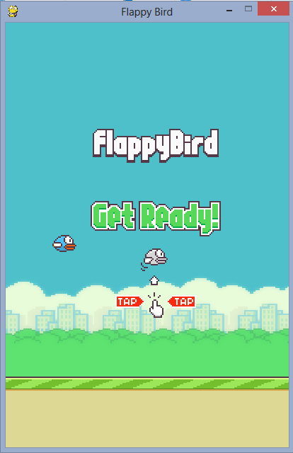

# Flappy Bird Q-Learning

A basic Flappy Bird game made in Python that integrates a Deep Q-Network (DQN) for automated gameplay.



---

## Overview

This project takes the classic Flappy Bird game—built using assets originally sourced from [FlapPyBird](https://github.com/zhaolingzhi/FlapPyBird-master) (credits to zhaolingzhi)—and enhances it using a Q-Learning algorithm combined with deep learning. The resulting game uses a DQN to learn optimal actions based on sensor inputs (angles and velocity) to navigate the bird through obstacles.


---

## Technologies Used

- **Python:** The primary language used for development.
- **PyTorch:** Utilized for building and training the deep neural network that powers the Q-Learning algorithm.
- **Pygame:** Used for game creation, rendering graphics, and handling user interactions.
- **NumPy:** Provides support for numerical computations and state processing.
- **Other Libraries:** 
  - `random` & `math`: For various mathematical operations and stochastic processes.
  - `time`: To manage delays and frame timing.
  - `collections.deque`: Used for experience replay in the Q-Learning process.

---

## How It Works

- **Game Environment:**  
  The game simulates a Flappy Bird scenario where the bird uses sensor data (angles and current velocity) to assess its surroundings. Pipes and ground elements move across the screen, and collision detection is used to determine game-over conditions.

- **Deep Q-Network (DQN):**  
  The neural network architecture includes:
  - An input layer that receives the normalized sensor readings along with the bird's velocity.
  - Two hidden layers with 128 and 64 neurons respectively, each using the ReLU activation function.
  - An output layer that outputs Q-values for two possible actions: "do nothing" or "flap."

- **Training Process:**  
  The training process involves:
  - **Experience Replay:** Storing gameplay experiences in a replay buffer to break the correlation between consecutive samples.
  - **Epsilon-Greedy Policy:** Balancing exploration and exploitation during training, gradually reducing the exploration factor (`epsilon`) over time.
  - **Optimization:** Using the mean squared error loss function and the Adam optimizer to update the network weights based on the difference between current and target Q-values.

- **Running the Game:**  
  Once trained, the model is loaded into the game, allowing the AI to control the bird. The game loop continuously updates the state (using sensor inputs) and lets the AI decide whether to flap or not, creating an engaging autonomous gameplay experience.

---

## Video Demo


---

## Getting Started

1. **Clone the repository:**

   ```bash
   git clone https://github.com/Mayank-MSJ-Singh/Flappy-bird-QLearning.git
   cd Flappy-bird-QLearning
   ```

2. **Install the dependencies:**

   ```bash
   pip install -r requirements.txt
   ```

3. **Run the Game:**

   Launch the game with the AI control:

   ```bash
   python FlappyAI.py
   ```

---
## Credits

- **Game Assets:**  
  Assets are courtesy of [FlapPyBird](https://github.com/zhaolingzhi/FlapPyBird-master). Many thanks to zhaolingzhi for providing the base game assets.

## License

Feel free to use, modify, and distribute the code for your own projects.

---

Crafted with a blend of innovation and simplicity. Enjoy tweaking and exploring further!
